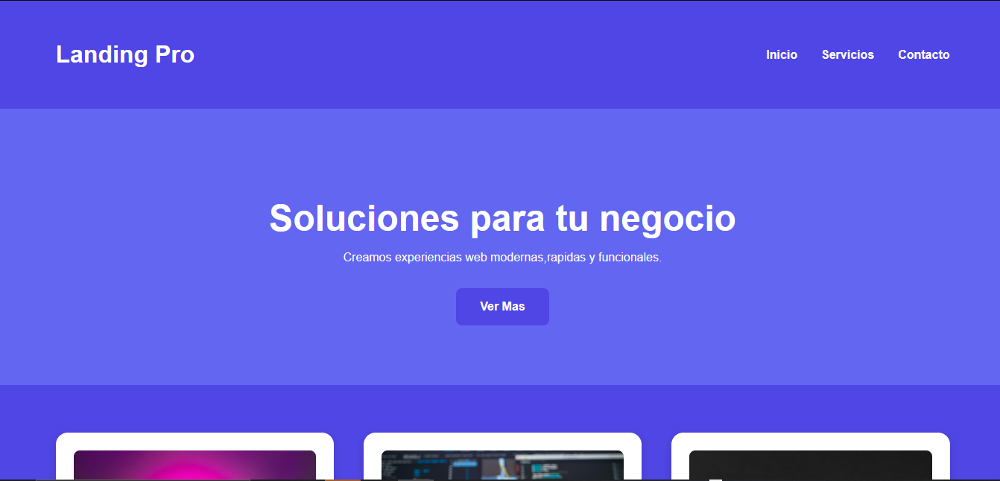
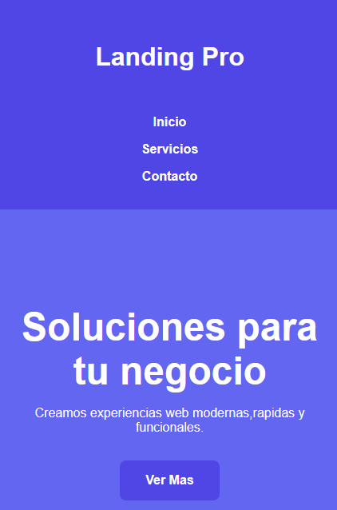
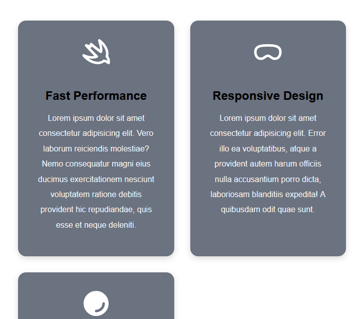
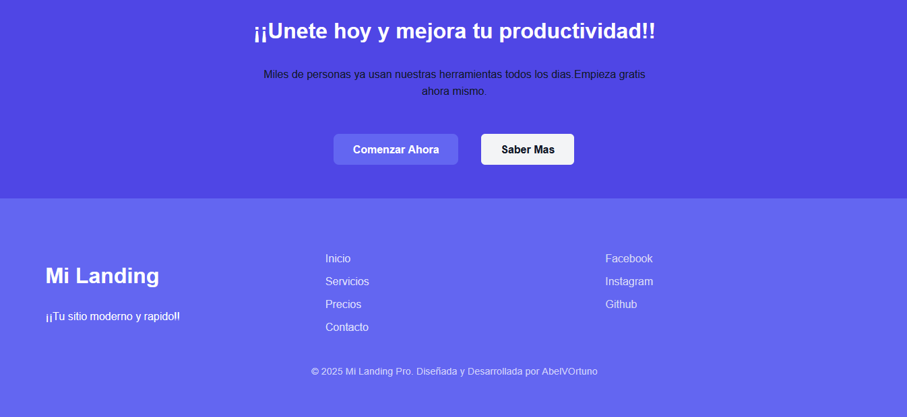

# Proyecto 01 - Landing Page Moderna (HTML + SASS)

## Descripcion del proyecto

Este proyecto es la primera pieza del Portafolio Profesional de 12 proyectos, cuyo objetivo es reforzar mis bases como desarrollador web y construir una coleccion de sitios modernos,bien estructurados,organizados y totalmente adaptables a diferentes pantallas.

Esta Landing Page ha sido diseñada y desarrollada con HTML + SASS, aplicando variables, mixins ,estilos en bloque (BEM) y una arquitectura escalable.

El enfoque principal: practica realista,creacion de un codigo limpio y reutilizable.

## Tecnologias utilizadas 

- HTML5

    - Variables
    - Mixins
    - Responsive Design
    - Arquitectura modular (BEM)
- Git & Github (flujo profesional con ramas de trabajo)

## Secciones incluidas en esta landing

- Header responsive
- Seccion hero
- Cards responsivas con grid
- Sistema de SASS modular
- Mixins reutilizables para mobile/tablet/desktop

- Variables globales para colores,tipografias y espacios.

- Arquitectura escalable para proyectos futuros

*Proximas*
- Seccion Features
- Footer completo


## Como compilar SASS

Este proyecto usa SASS global, asi que solo necesitas:

```
sass --watch src/sass/app.scss:css/app.css
```

## Como clonar este proyecto 

```
git clone [Landing Page Pro](https://github.com/AbelVOrtuno/Portafolio-Formal-Gigante.git)

cd landing-modern-01
```

## Roadmap (lo que falta agregar)

- [] Agregar seccion Features
- [] Animaciones ligeras en hover
- [] Footer responsive
- [] Optimizacion SEO (meta tags, Open Graph, etc)
- [] Publicacion en Github Pages
- [] Revision completa para portafolio

## Aprendizajes obtenidos
- Arquitectura modular con SASS
- Uso de mixins para responsive
- Flujo profesional de Git (main + feature branches)
- Construccion de portafolio solido desde el primer proyecto
- Como estructurar un proyecto real desde cero

## Rutas de despliegue 

Este proyecto esta configurado para funcionar correctamente tanto en entorno local como en produccion.Cuando el sitio sea publicado,deberas actualizar las rutas absolutas en:

- `favicon.ico`
- `brand-icon.svg`
- `og:image`

Ejemplo:

```
html
<meta property="og:image" content="assets/img/icons/bannerOG.png">
```

## Estado del proyecto

Este proyecto esta completado al 100% como parte de mi portafolio que contiene varios de mis proyectos y muestra lo que he aprendido con el tiempo.

Incluye: 
- Diseño responsive
- SASS modular
- Mixins reutilizables
- SEO basico
- Metadatos optimizados
- Imagenes optimizadas con (Lazy loading)
- Estructura profesional para portafolio

## Mira una vista previa del sitio



Modo Laptop

## Vista adaptable



## Secciones Principales

**Seccion features**


**Footer**



## Autor 

**Abel Valverde Ortuño**

Desarrollador Web FrontEnd
HTML | CSS | SASS | JavaScript | Git & Github

## Derechos 

&copy; 2025 Diseñado y Desarrollado por AbelVOrtuno

Este proyecto es de uso personal y educativo.
No se permite su distribucion o uso comercial sin autorizacion.